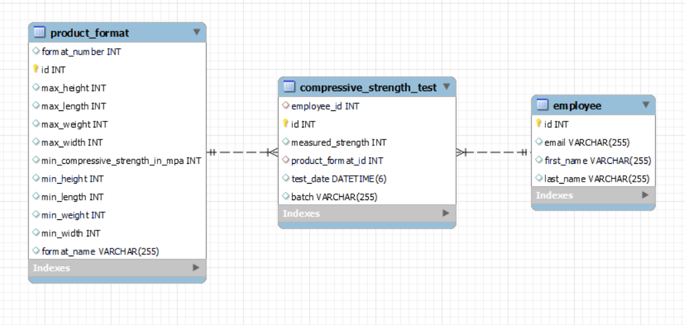

# Reports App

Ceramic hollow bricks are widely used as a construction material. During its production several parameters are measured and noted on 
paper reports by machine operators. Compressive strength is one of the crucial parameters checked after firing of ceramics prefabricates and for 
each brick format there is a given minimum value of compressive strength measured during production. 
<br><br>
Reports App enables end-user to manage employees 
and compressive strength tests done by them on each format produced in batch. Three entities are introduced - Employee, ProductFormat and
CompressiveStrengthTest. Relations between them are obtained by @OneToMany and @ManyToOne annotations. 
<br>




---
## Content of Project
- [Technologies](#Technologies)
- [Installation](#Installation)
- [License](#License)
- [Contact](#Contact)

---
## Technologies
<ul>
<li>Java</li>

<li>Spring Boot</li>

<li>MySQL Server -> mySQL database for storing entities</li>

<li>Hibernate -> ORM mappings with relations @OneToMany and @ManyToOne. In DAO layer interfaces like EntityManager, Query and TypedQuery are used for managing entities stored in database.</li>

<li>Spring Security -> basic auth for two roles - User and Admin. @PreAuthorize for controller classes with role USER and for methods in controller handling http requests POST, PUT, DELETE with role ADMIN. There is
one controller for obtaining csrf token, which has to be passed in header as X-CSRF-TOKEN for adding, updating and deleting entities from db.</li>

<li>MapStruct -> creating DTOs from entities and vice versa with @Mapper annotated methods. Creating and updating entity with relations is now possible with one @RequestBody without ids as @PathVariable</li>

<li>Swagger -> API documentation</li>
</ul>

---
## Installation

- Install Java 17 OpenJDK
- Clone repository
  ```
  git clone https://github.com/fluderszymon/reports.git
  ```
- Database Setup
  - Install MySQL server and MySQL Workbench
    - MySQL Server 8.0.42
    - MySQL Workbench 8.0.42
  - Create "reports" database and connect database user
  - Set application properties
     ```
      spring.datasource.url=jdbc:mysql://localhost:3306/??????
      spring.datasource.username=??????
      spring.datasource.password=??????
      ```
  - Populate the database
    - Start the application, so tables can be auto generated
    - Execute script [populate_database.sql](docs/populate_database.sql) to insert example data into tables
    
- Testing in Postman 
  - Import [Reports Project.postman_collection.json](docs/Reports%20Project.postman_collection.json) into Postman in order to test API endpoints

---
## License
Distributed under the GNU GENERAL PUBLIC LICENSE

---
## Contact
- szymon.fluder@outlook.com
- www.linkedin.com/in/szymonfluder
