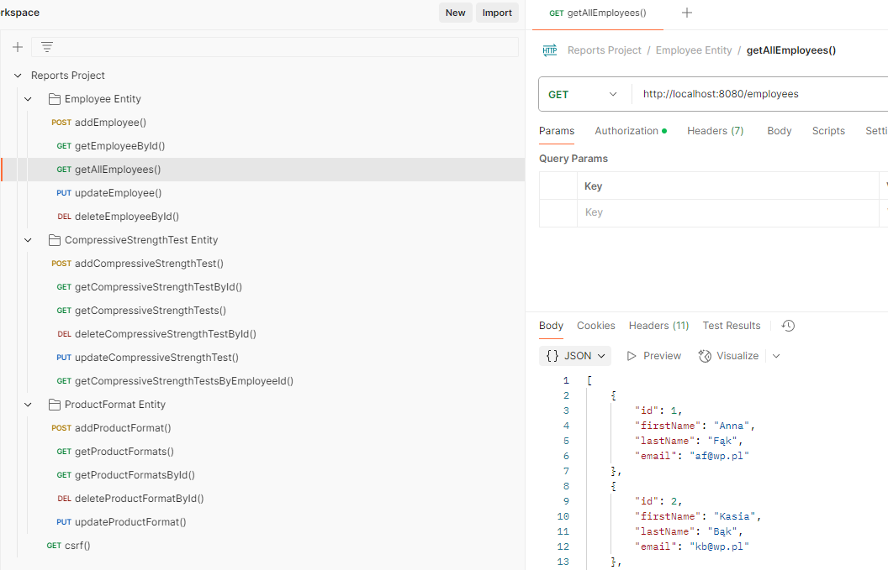

# Reports App

Ceramic hollow bricks are widely used as a construction material. During their production, several parameters are measured and recorded on 
paper reports by machine operators. Compressive strength is one of the crucial parameters checked after firing of ceramics prefabricates, and for 
each brick format, there is a specified minimum value of compressive strength that must be met during production. 
<br><br>
The Reports App enables end-users to manage employees 
and compressive strength tests they perform for each format produced in batch. Three entities are introduced: Employee, ProductFormat and
CompressiveStrengthTest. Relationships between them are defined by @OneToMany and @ManyToOne annotations. 
<br>




---
## Content of Project
- [Technologies](#Technologies)
- [Installation](#Installation)
- [License](#License)
- [Contact](#Contact)

---
## Technologies
<ul>
<li>Java</li>

<li>Spring Boot</li>

<li>MySQL Server -> mySQL database for storing entities</li>

<li>Hibernate -> for ORM mappings with @OneToMany and @ManyToOne relationships. In DAO layer interfaces like EntityManager, Query and TypedQuery were used for managing entities stored in a database.
These interfaces enabled author to learn more about JPQL expressions. JPA Repository impl could be used as an alternative to this solution.</li>

<li>Spring Security -> basic auth for two roles - User and Admin. @PreAuthorize for controller classes with role USER and for methods in controller handling http requests POST, PUT, DELETE with role ADMIN. There is
one controller for obtaining csrf token, which has to be passed in header as X-CSRF-TOKEN for adding, updating and deleting entities from db.</li>

<li>MapStruct -> creating DTOs from entities and vice versa with @Mapper annotated methods. Creating and updating entity with relations is now possible with one @RequestBody without IDs as @PathVariable</li>

</ul>

---
## Installation
- Install Java 17 OpenJDK
- Clone repository
  ```
  git clone https://github.com/fluderszymon/reports.git
  ```
- Database Setup
  - Install MySQL server and MySQL Workbench
    - MySQL Server 8.0.42
    - MySQL Workbench 8.0.42
  - Create "reports" database and connect database user
  - Set application properties
     ```
      spring.datasource.url=jdbc:mysql://localhost:3306/??????
      spring.datasource.username=??????
      spring.datasource.password=??????
      ```
  - Populate the database
    - Start the application, so tables can be auto generated
    - Execute script [populate_database.sql](docs/populate_database.sql) to insert example data into tables
    
- Testing in Postman 
  - Import [Reports Project.postman_collection.json](docs/Reports%20Project.postman_collection.json) into Postman in order to test API endpoints

---
## License
Distributed under the GNU GENERAL PUBLIC LICENSE

---
## Contact
- szymon.fluder@outlook.com
- www.linkedin.com/in/szymonfluder
